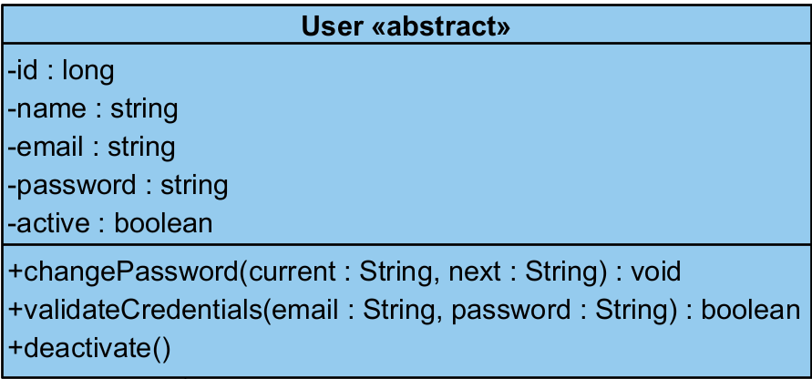
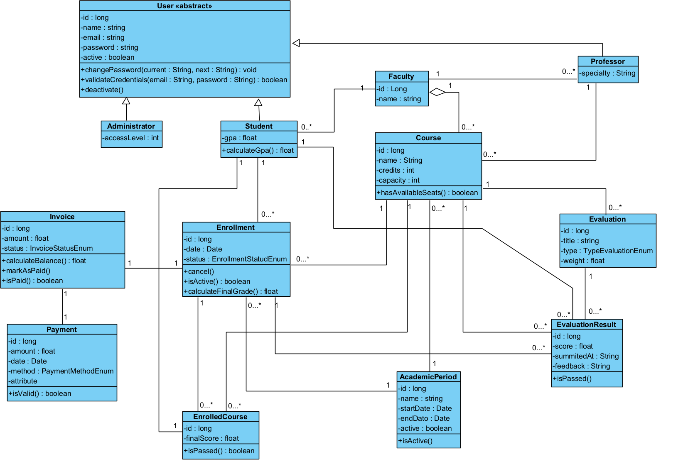

# Taller Bloque 3

# Actividad 1

- **User (abstracto)** — Representa a cualquier persona que interactúa con el sistema. Contiene la información básica de identidad y acceso (nombre, email, contraseña). No existe por sí solo, siempre es un tipo específico de usuario.
- **Administrator** — Es un tipo de usuario con privilegios especiales. Tiene un nivel de acceso que determina qué puede hacer dentro del sistema.
- **Student** — Es el usuario central del sistema. Tiene un promedio académico (GPA) y es quien se matricula en cursos.
- **Professor** — Es el docente que dicta los cursos. Tiene una especialidad que lo relaciona con las materias que puede enseñar.
- **Faculty** — Representa una facultad o departamento académico (ej. Ingeniería, Medicina). Agrupa cursos y profesores bajo una misma área del conocimiento.
- **Course** — Es la materia o asignatura ofrecida. Tiene un nombre, créditos académicos y un cupo máximo de estudiantes.
- **Enrollment** — Representa el acto formal de un estudiante de inscribirse en un período académico. Contiene el estado de la matrícula y permite calcular la nota final.
- **EnrolledCourse** — Es el registro de un estudiante en un curso específico dentro de una matrícula. Guarda la nota final de ese curso.
- **AcademicPeriod** — Representa el semestre o período académico (ej. 2025-1). Define fechas de inicio y fin y si está activo actualmente.
- **Evaluation** — Es una actividad evaluativa dentro de un curso (parcial, taller, proyecto). Tiene un peso porcentual y un tipo.
- **EvaluationResult** — Almacena la calificación que obtuvo un estudiante en una evaluación específica. Incluye retroalimentación y fecha de entrega.
- **Invoice** — Es la factura generada para el estudiante por concepto de matrícula. Refleja el valor a pagar y su estado de pago.
- **Payment** — Registra un pago realizado por el estudiante. Incluye el monto, la fecha y el método de pago utilizado.

### 2. ¿Cuáles son los objetos principales?

Los objetos principales son aquellos alrededor de los cuales gira el propósito del sistema:

- **Student** — Es el actor central; todo el flujo del sistema ocurre en función de el.
- **Course** — Es el recurso academico fundamental que el sistema gestiona.
- **Enrollment** — Es la acción core del sistema: conecta al estudiante con los cursos en un período.
- **AcademicPeriod** — Da el contexto temporal a todo, sin él nada tiene lugar.
- **Professor** — Es quien hace posible que un curso exista y se dicte.

### 3. ¿Cuáles apoyan el sistema?

Los objetos de apoyo son los que complementan y dan soporte a los flujos principales:

- **User / Administrator** — Dan estructura de acceso y seguridad al sistema.
- **Faculty** — Organiza y agrupa los cursos y profesores.
- **Evaluation / EvaluationResult** — Soportan el proceso de calificación.
- **Invoice / Payment** — Soportan el proceso financiero de la matrícula.
- **EnrolledCourse** — Es un registro de soporte que conecta matrícula con curso y guarda resultados.

# Actividad 2



Clase Estudiante que exitiende la clase abstracta User


# Actividad 3

### Encapsulamiento

El encapsulamiento se aplicó de forma consistente en todo el diagrama: todos los atributos están marcados como privados (con el signo -), lo que significa que ninguna clase externa puede leer o modificar directamente, por ejemplo, el GPA de un estudiante o el saldo de una factura. Para interactuar con esos datos, el sistema obliga a usar los métodos públicos (con +). Un buen ejemplo es la clase Invoice: nadie puede cambiar el monto directamente, sino que se debe pasar por métodos como calculateBalance() o markAsPaid(). Esto protege la integridad de los datos y centraliza la lógica de negocio dentro de cada clase.

### Herencia

La herencia se ve claramente en la jerarquía de usuarios. La clase User es abstracta y define los atributos y comportamientos comunes a cualquier persona del sistema (nombre, email, contraseña, métodos de validación). De ella heredan Student, Professor y Administrator, quienes obtienen todo eso automáticamente y además agregan lo propio de su rol: Student tiene GPA, Professor tiene especialidad, Administrator tiene nivel de acceso. Esto evita repetir código y establece una relación natural del tipo "un estudiante es un usuario".

### Abstracción

La clase User es el mejor ejemplo de abstracción: existe para definir el concepto general de "persona en el sistema" sin representar a nadie concreto. Nunca se instancia directamente. Otro ejemplo es el uso de enumeraciones como TypeEvaluationEnum o PaymentMethodEnum, que abstraen categorías de valores posibles sin exponer su implementación interna. El método hasAvailableSeats() en Course también abstrae la lógica de verificar cupos: quien lo llama no necesita saber cómo se calcula, solo necesita el resultado.

### Polimorfismo

Aunque el diagrama no muestra métodos sobrescritos explícitamente, el polimorfismo está implícito en la herencia de User. Si el sistema tiene un proceso que recorre una lista de usuarios y llama a validateCredentials(), ese método se ejecutará de forma potencialmente diferente según si el objeto es un Student, Professor o Administrator. Adicionalmente, el método isValid() en Payment y isPassed() tanto en EnrolledCourse como en EvaluationResult representan comportamientos similares con el mismo nombre en contextos distintos, lo cual es la esencia del polimorfismo: mismo mensaje, respuesta adaptada al contexto.

# Actividad 4



# Actividad 5

### 1. ¿Qué clase es más importante?

Enrollment es la clase más importante del sistema. Es el nodo central que conecta casi todo: un estudiante, un período académico, una factura y los cursos inscritos. Sin ella, no existe el flujo académico ni el financiero. Si Enrollment falla o está mal diseñada, el sistema entero se rompe. Su existencia es la razón de ser de la aplicación.

### 2. ¿Cuál cambiaría más si el sistema crece?

Course y Enrollment serían las más afectadas. Si el sistema creciera para soportar modalidades virtuales, horarios, salones, listas de espera o prerequisitos, Course necesitaría muchos atributos y relaciones nuevas. Enrollment también cambiaría si se añaden reglas de negocio más complejas como descuentos, becas o restricciones académicas. En general, cualquier clase que está en el centro del negocio es la más volátil ante nuevos requerimientos.

### 3. ¿Qué parte podría reutilizarse en otra app?

El módulo de usuarios y autenticación (User, Administrator, con sus métodos de validateCredentials y changePassword) es completamente reutilizable en cualquier sistema que requiera control de acceso. De igual forma, el módulo de pagos e facturación (Invoice, Payment) podría trasladarse a cualquier aplicación con cobros, como un sistema de biblioteca, gimnasio o clínica, con mínimas modificaciones.

# Actividad Opcional

### Errores identificados

1. Payment tiene un atributo -attribute sin nombre ni tipo: Este campo es claramente un placeholder olvidado. En un diseño real no tiene sentido y podría llevar a errores de implementación.
2. La relación entre Professor y Course no tiene clase de asociación: Un profesor dicta un curso en un período específico, pero esa relación no está capturada en ninguna clase. Si el mismo curso es dictado por profesores distintos en semestres distintos, el modelo actual no puede representarlo correctamente.

### Propuesta

Se propone crear una clase CourseOffering que represente la oferta concreta de un curso en un período académico específico, dictada por un profesor específico. Esta clase conectaría Course, Professor y AcademicPeriod, y sería la entidad a la que realmente se matricula un estudiante, no al Course abstracto.

```bash
CourseOffering
- id : long,
- course : Course,
- professor : Professor,
- academicPeriod : AcademicPeriod,
- schedule : String,
- classroom : String,
```

En una universidad, un estudiante no se inscribe en "Cálculo I" en abstracto, sino en "Cálculo I, grupo 2, dictado por el Prof. García, semestre 2025-1". Sin esta clase, el modelo es incapaz de manejar múltiples secciones del mismo curso, distintos profesores por semestre, o histórico de quién dictó qué. La refactorización no rompe el diseño existente, sino que lo hace más fiel al mundo real y más escalable.